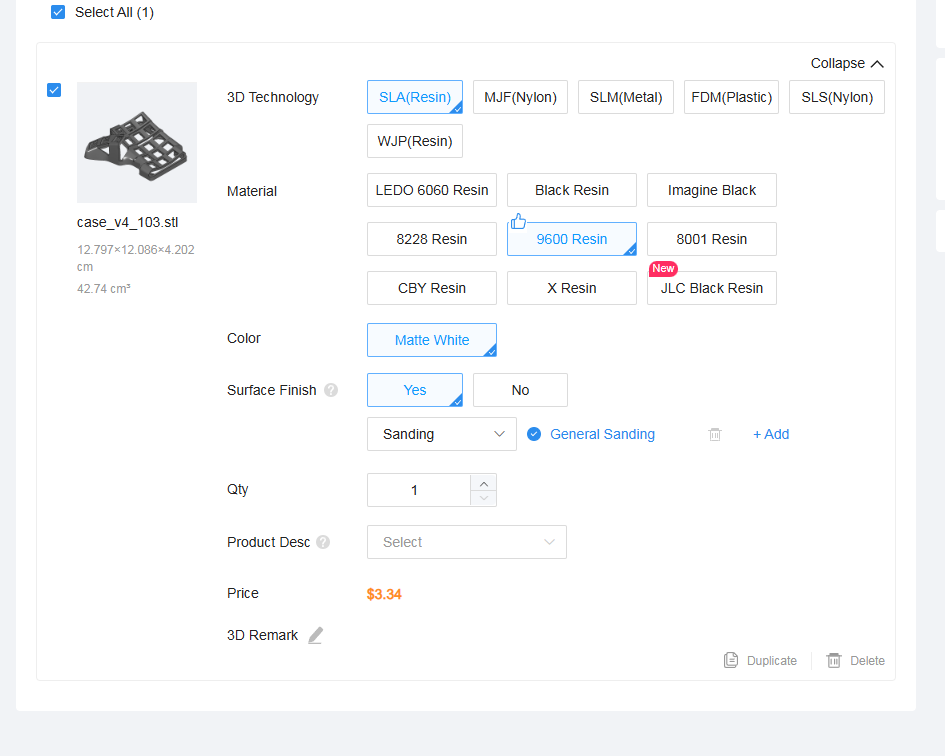
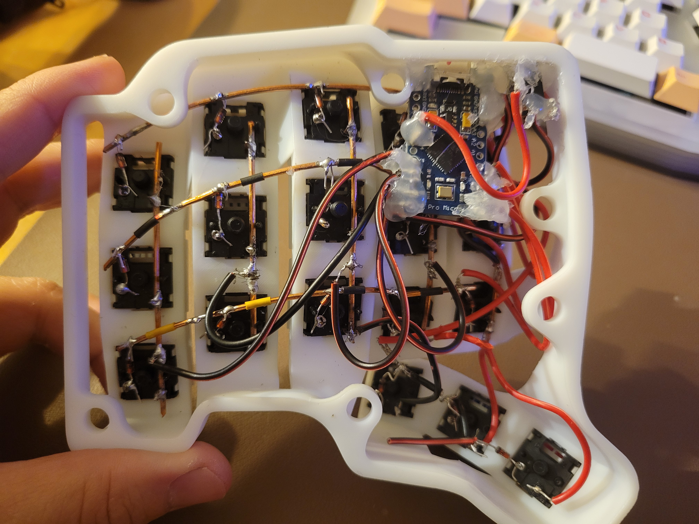
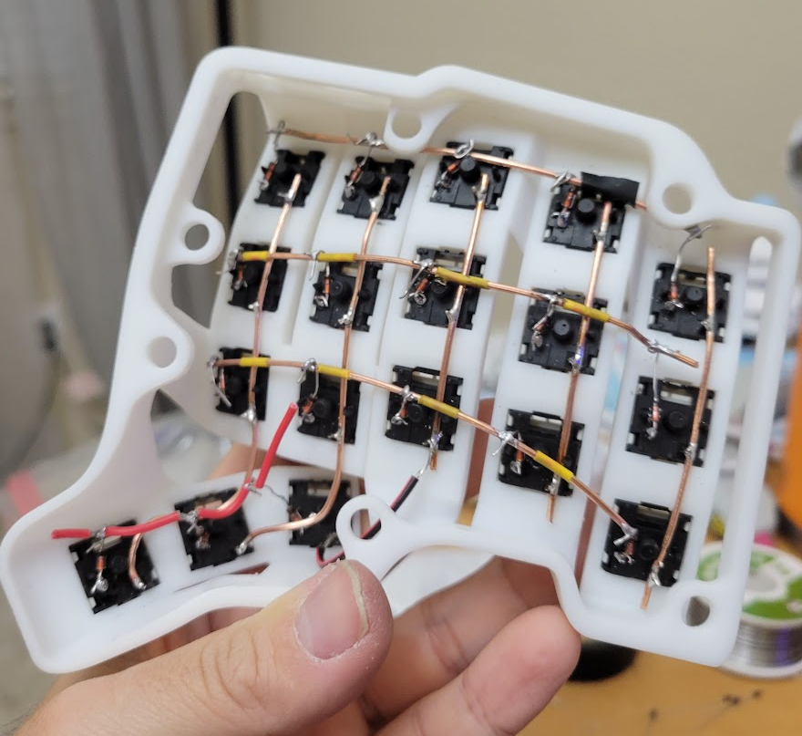

# **skellyyeume**
This is a guide on how to hardwire build a TBK skeletyl <br>

https://bastardkb.com/product/skeletyl-kit/
https://github.com/Bastardkb/Skeletyl/tree/main?tab=readme-ov-file

# Table of Contents
1. [Rules](#rules)
2. [Useful Links](#usefullinks)
3. [Prerequisites & things to download](#prereq)
4. [BOM (Bill of materials)](#bom)
5. [How does handwiring keyboard work?](#howthehell)
6. [What are all these files in the firmware folder?](#whatthehell)
7. [Getting the firmware onto the microcontroller](#buildfirmware)
8. [Wiring up the board](#wiring)
9. [Okay I wired everything, but it doesn't work...](#debug)
10. [Future...](#todo)


<br>

___

<br>

<div id='rules'>

# Rules

- NEVER unplug the TRRS jack from either half of the keyboard while it is plugged in via usb to the computer.
- ALWAYS flash the firmware to both microcontrollers when making changes.

<br>

___

<br>

<div id='usefullinks'>

# Useful Links 
https://docs.qmk.fm/features/split_keyboard<br>
https://docs.splitkb.com/troubleshooting/one-half<br>
https://docs.qmk.fm/keycodes_basic<br>
https://docs.qmk.fm/feature_layers<br>
https://docs.qmk.fm/mod_tap (if you want to use [**homerow mods**](https://precondition.github.io/home-row-mods))

<br>

___

<br>

# Disclaimer: 
- You do not need any prior programming background, but it helps.
- This guide assumes you have some experience with soldering.
- keymapping this keyboard currently only works through modifying the [keymap.c](firmware/skellyyeume/keymaps/default/keymap.c) file in the firmware folder (please use the default keymap folder for now). The via keymapper doesn't work properly (mainly because via thinks this keyboard is a dactyl manuform, which it is not. Basically there are vid (vendor id)/pid (product id) fields in keyboard.json which via looks up to determine what keyboard it is when we load the keyboard on the via website. I just borrowed one from dactyl at the time...)

<br>

___

<br>

<div id='prereq'>

# Prerequisites & things to download:

- It is **highly** recommended to watch Joe scotto's vid, https://youtu.be/hjml-K-pV4E?t=41&feature=shared. Yes it is 20 minutes long, but it goes over very important fundamnetals and techniques that will be useful for completing this build.

- [QMK MSYS](https://msys.qmk.fm) <details>
<collapse> </collapse>
This is the CLI (Command Line Interface, think of it like the command prompt/power shell on windows (or if you're a mac user, the terminal), but it comes with lots of prebuilt tools, and also has Git preinstalled so you don't need to go through manually setting up Git on your machine). Install it wherever you like, as long as you can find it later.
</details>

- [VS Code](https://code.visualstudio.com/download)<details>
<collapse> </collapse>
Text editor of choice, you'll use this to modify the keymap later when building the firmware.
</details>

<br>

___

<br>

<div id='bom'>

# BOM:
- Case/Plate <details>
<collapse> </collapse>
if you have a 3d printer, feel free to use the files
[case](https://github.com/Bastardkb/Skeletyl/blob/main/V4/case_v4_103.stl) , [plate](https://github.com/Bastardkb/Skeletyl/blob/main/V4/plates/plate_v4_103.stl) and print them yourself. I personally went with https://jlc3dp.com and chose their 9600 Resin option. You can see it doesn't cost a lot. The part that costs the most is the shipping, as this company is located in Hong Kong (for me it was ~20 dollar shipping.)  
</details> 

- [Pro Micro](https://www.amazon.com/dp/B0D83FBYPD?ref=ppx_yo2ov_dt_b_fed_asin_title)
- [TRRS cable (if you don't have one)](https://www.amazon.com/Auxiliary-Braided-Compatible-Stereos-Headphones/dp/B07PJW6RQ7?crid=M0JVQ8AC44R2&dib=eyJ2IjoiMSJ9.x8XyTX_WjBB74z2o_RS3wZouPmAvfc9lsTF2XwadVspnsXhCyZ3sEjrJIFvcj07VjPb2ukVEcHMMdFqQQ5WnilRhUtSXqpUNZeYQrIj6PCi3d0s-_3WaSPNqsxLHPGGlmoelcC116vqeaLxyneCUOdxsF61USm3T56SrBBsqNiOE8nwHdqjUuTznev3zTZjn67bkJ3-58j1BcJup_rc7W6c5BgaXe67HN8kMBzFW7Ks.w0K85m45D4xlSl5SNSa1YeLz5AXxlyIiPARfxesFRcA&dib_tag=se&keywords=trrs+cable&qid=1743568676&sprefix=trrs+cab%2Caps%2C173&sr=8-3)
- [TRRS jack](https://www.amazon.com/uxcell-Connector-Female-Socket-PJ-320A/dp/B07KXZ6T3D?dib=eyJ2IjoiMSJ9.5VGTNb80dxu3oo0avJPM9Z9LNGvpT85MTJS8sOLkSrD91o5140na1eeToQN8mSKX0kUHNauVv19QxmRHMvqKts9XhCDL5ACRRBtrTjbySfnvGx5ehynBM3MiuiPcmDZ52uHtuv5MUD5cGwvlTXAGT9ZKohi6Ioh4NxmFxMQbYObZJguELrT73il9QgBC4bS9ONDyj6gylXU5DhPkSw8xnzWsiZIoKzAecX9OZSVtrPQ.su6CPoWc3V_3lI0K1bqFUdlCaWO7_RsF8YB98WO36gI&dib_tag=se&keywords=trrs%2Bjack&qid=1743568599&sr=8-3&th=1)
- [[OPTIONAL] 16 gauge copper wire](https://www.amazon.com/dp/B000BP7WH8?ref=ppx_yo2ov_dt_b_fed_asin_title) - This is to provide a cleaner way to wire up the columns/rows, but it can be done without.
- [22AWG wire](https://www.amazon.com/dp/B00QTCBZ4I?ref=ppx_yo2ov_dt_b_fed_asin_title)
- [1N4148 diodes](https://www.amazon.com/BOJACK-Switching-IN4148-Electronic-Silicon/dp/B07Q4F3Y5W?dib=eyJ2IjoiMSJ9.sedX-2SqjP9L7wpQjWYA0GaXV-QkbK_pbWm0WxlQYFl6z3hBYiCDgVeEmaTSB3LY4hOifq8OnAfbkj4lxYFp6CcR7OBceK-xOqktDNobKpaGUl5ZwAfWq0mCjzSvKFdnwZIdhk8OMA1rYsVNIdQJdPEhERnFVR2pOgfj66s7_3CdUeJaQ3o65ilHOWPbDFyA6PIVWuhqhip31hUat-ydiInizcFJcPpuH9p2H4v3pE5jPWASyGNkSRb7sfomdxElENGJQnGwggEr1OTFpMjHGauLn-27fHZUZA9iLlGV1Yw.iYwXa-htPiFfMM3-LXdCHRdh3RPWTrGMe7ryVcWULas&dib_tag=se&keywords=1n4148+diode&qid=1743657530&s=automotive&sr=1-3)
- [solder iron](https://www.amazon.com/dp/B06XZ31W3M?ref_=ppx_hzsearch_conn_dt_b_fed_asin_title_5&th=1)
- [solder wire](https://www.amazon.com/dp/B01M071WEE?ref=ppx_yo2ov_dt_b_fed_asin_title)
- [glue gun](https://www.amazon.com/Krightlink-Sticks-School-Crafts-Repairs/dp/B0BC878ZRG?dib=eyJ2IjoiMSJ9.rmkAqlNRv8pqMmb3ec-MNIcZ4qYWbCLkmF5lOBnTC-HAPj7n46O2V2tLV-vKhciBogzJgJpRIsv84L5OkF8YjoJ0HyRO3NtFR9OYYBanuuB-LQXVbrBiX_reJxbL8KfhT6vHG4kInrd4127DaPn-t2ohqrNR_aQym0O2RtZEysEkyW2lJrY0g6aNUVabdtGEaEnyNXzshyFv_zPI6PGFV6jF1v8CADZFMhy1cOxaS4KTal_IjPqOCQhAgUxXQCTEIHewi5u6t5ZGyZ0r_yupV9SWv1lPNzQHvmlztWWJxZ8.KxsKpr_op73ubOFDrDzO6KwYIp-oIp8mn7Gzpfst2dA&dib_tag=se&keywords=glue%2Bgun&qid=1743659006&sr=8-6&th=1)

<br>

___

<br>

<div id='howthehell'>

# How does handwiring keyboard work?
Imagine the keyboard as a matrix grid, like tic-tac-toe. As every switch has 2 metal pins, a collection of one of the pins on each switch can be wired together to form columns, and the other pin can be used for rows. Each row and column is designated to a pin on the microcontroller, and based on a switch press on the grid, the keyboard recognizes the keystroke to the designated key command.

<br>

___

<br>

<div id='whatthehell'>

# What are all these files in the firmware folder?
I've went ahead and dropped comments where I could, and also made [an explanation file of keyboard.json](keyboard.json_explanation.yaml), but these are the most important files. If you're curious about each line by line, you can google them easily by querying something like `soft_serial_pin qmk`.:
- keyboard.json - sets up the basic information about your keyboard (keyboard matrix layout, what sort of microcontroller is used, what pins on the microcontroller are used, etc.)
- keymap.c - contains different keymap profiles/layouts based on what tools you'll be using (ex. via). This is the file that you want to modify if you want custom keymapping.
- config.h, rules.mk - similar to keyboard.json, but has additional settings.

<br>

___

<br>

<div id='buildfirmware'>

# Getting the firmware onto the microcontroller

1. Open QMK MSYS, and input `qmk setup`. This process will take some time depending on your internet connection. It basically prepares your machine with necessary tools to start building your firmware, and clones the [qmk_firmware github repo](https://github.com/qmk/qmk_firmware) on to your machine.
2. Once the setup has finished, you can copy the folder `skellyyeume` under `firmware` of this repo, and paste it under `/keyboards/handwired` of the `qmk_firmware` folder (so it would look like `/keyboards/handwired/skellyyeume`)
3. Modify `keymap.c` (under the **default** folder) to your desired layout in VS Code. [Useful Links](#usefullinks) for selecting your keycodes.
4. Head back to QMK MSYS, and type the following
```
cd qmk_firmware
```

```
qmk compile -kb handwired/skellyyeume -km default
```

once successfully compiled you should see a message like the following and find the file that was generated at the root of the qmk_firmware folder:


```
qmk flash -bl avrdude handwired_skellyyeume_default.hex
```
 <br>
You'll first be prompted to put the microcontroller in DFU/bootloarder mode to flash the firmware. You can achieve this by briefly touching the RST & GND Pin on the microcontroller with some tweezers. Please see the [pinout](pictures/pinout.jpg). It only takes a gentle tap on the pins and you'll see a very tiny red led light up for half of a second when you short these pins. Wait for 5~10 seconds and then biggerf red LEDs will flash and you'll see more console lines printed on QMK MSYS console like below. <br>


The above command simply translates to...<details>
<collapse> </collapse>
```
change directory to qmk_firmware
compile the firmware using the default keymap.c from the /keymaps/default folder
flash the firmware file generated
```
</details> 

<h1 style="color: red; font-weight: bold"> Repeat the process for a second microcontroller, which will be used for the other half of the keyboard. </h1>

<br>

___

<br>


<div id='wiring'>

# Wiring up the board (FINALLY)
Here are some rough pictures on what it will eventually look like , 

The following is the exact wiring diagram based on my board. Please pay close attention as column-to-microcontroller connections are mirrored between the halves.

 
 


1. I first inserted the switches into the case. Note the orientation of the switches. While it is not required to do the exact same, I found this to be the easiest for soldering purposes. <details><collapse>


</collapse></details>
2. Prepare 24 sleeved wires cut up to roughly 3 - 4 inches in length. Each end of the wire must be degloved (1/8 - 1/4 inch) so that they can be soldered. In addition, prepare the copper wires for the row/columns accordingly (if you're using them).
3. I soldered the columns first since they're the easiest, then the diodes (please refer to pro tip on getting the diode on the switch pin below under "callouts" section), and then finally the rows. **NOTE** The direction of the diode is **EXTREMELY** important here. In the firmware creation step above, we specified `COL2ROW` in our keyboard.json, this means that our cathode (black line) is oriented toward the row wire. <details><collapse>

</collapse></details>
4. Do the same for the other half of the keyboard.
5. Now for the messy part, using the sleeved wire bits from earlier, solder each pin to the corresponding column/row as specified in the wire diagram above. In addition, connect the TRRS jack wires as well.
6. If everything has been wired correctly, you can connect the halves first using the TRRS cable and then connect the left half keyboard to the computer.

## Few callouts:
- Inevitably, there will be parts of the row wire where it will touch the column wire. In order to prevent shorting out the connection, you must wrap a non-conductive material (ex. shrink tubing or electrical tape) on the contact points. Refer to the images above for reference.
- When connecting the row/column wires to the microcontroller, it doesn't matter which end or what part of the row/column wire you solder to.
- If you're a keen observer, you probably asked yourself "why did this guy connect B3 pin to the second row and B2 pin to the third row?". It was a careless mistake, but it can be easily fixed where you solder B2 pin to the third row and B3 pin to the second row, but then you have to modify the order of row pins in [keyboard.json](firmware/skellyyeume/keyboard.json) so that `["B1", "B2", "B3", "B6"]` is now `["B1", "B3", "B2", "B6"]`
- Pro tip for wiring the diodes on to the switch pin <details><collapse>
You can curl the end of the diode without the black line, snip the extra wire past the loop, place it on to the switch pin, and then solder it in place. 


</collapse></details>

<div id='debug'>

# Okay I wired everything, but it doesn't work...
- the left half of the keyboard won't turn on
<br>&nbsp;&nbsp; - is the USB plugged in all the way? Try a different port on the computer? Try to connect to a different machine?
- the left half of the keyboard turns on, but the right half won't
<br>&nbsp;&nbsp; - check the VCC pins on both microcontrollers to make sure that the solder or the wire hasn't come off or something. There is a chance that you have a bad TRRS jack (hopefully not), but if you do, you'll need a voltmeter to test for continuity on each of the TRRS jack pins.
- both halves turn on, but the right side keypress isn't being registered
<br>&nbsp;&nbsp; - make sure you haven't modified [keyboard.json](firmware/skellyyeume/keyboard.json) or [config.h](firmware/skellyyeume/config.h) and that the correct pins (`D0` is what we've specified to in our firmware file) are soldered (on both the microcontroller and TRRS jack) as per the wiring diagrams above.
- both halves turn on, the keystrokes register, but they're flipped (pressing where A would normally be registers G)
<br>&nbsp;&nbsp; - check the wiring diagram to make sure your columns are wired up correctly. If you're facing an issue where pressing Q registers Z or something, check your rows.
- both halves turn on, the keystrokes register, but there are multiple being registered at once (ex. pressing J hits both J and space bar)
<br>&nbsp;&nbsp; - check that no bare wires are touching each other around the switch in question and also on the microcontroller.

<div id='todo'>

# TODO
- get via working (custom layout json maybe)
- vial support? (maybe...)